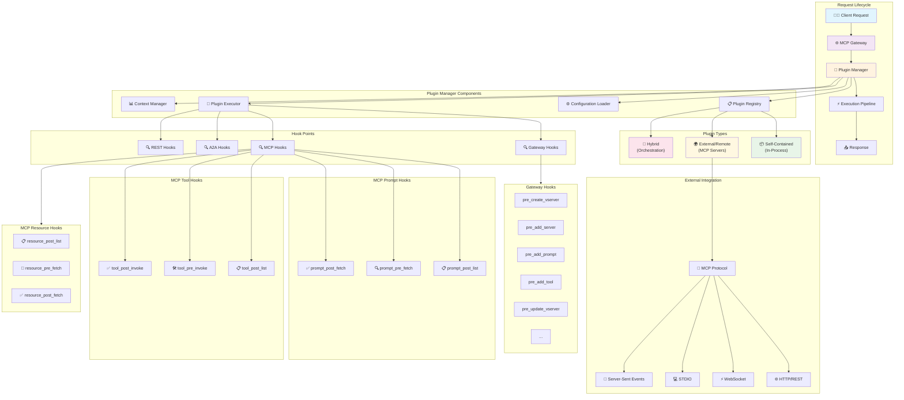

# Plugin System Architecture

The plugin framework implements a sophisticated execution pipeline designed for enterprise-grade performance, security, and reliability.

## Architectural Overview

Plugins can be classified by the sets of interfaces they support which determines which hook points the plugins will apply to. 



# Plugin Classes
We organize the plugins hierarchically by resources they protect and the interfaces they implement.
1. Gateway Administrative Hooks
    1. Servers
    1. Tools
    1. Virtual Servers 
1. MCP Hooks
    1. Tools
    1. Resources
    1. Prompts
    1. Roots
    1. Elicitation
    1. Sampling
1. A2A Hooks
    - _Future Work_
1. Agent Hooks
    1. LLMs
    1. Agents
    1. Tools (Native and MCP)
    1. Memory
    1. Reasoning (Think)
    1. Control Flow

## 
```python
class Plugin:
    """Base plugin for self-contained, in-process plugins"""

    def __init__(self, config: PluginConfig):
        self._config = config
```


## Gateway Administrative Hooks

- CRUD Tool: tool_pre_register / tool_pre_update / tool_pre_unregister
- CRUD Resources: resource_pre_create / resource_pre_update / resource_pre_delete
- Server Hooks: server_pre_register / server_post_register
- CRUD: server_pre_update / server_pre_unregister
- Attestation on add: server_pre_register will perform server attestation before admission (e.g., verify TLS certificate chain, mTLS/SAN/SPIFFE identity, and—where available—TPM/TEE/cloud instance attestation evidence). Failed checks block registration.
- CRUD hooks: auth_pre_create / auth_pre_update / auth_pre_delete (for roles, policies, clients/keys, grants)
- Federation hooks (federation_pre_sync / federation_post_sync)
- CRUD hooks: federation_pre_create / federation_pre_update / federation_pre_delete (remotes, schemas, replication rules)
- Completion hooks for LLM request/response processing (no CRUD—ephemeral)
- Cache hooks for cache manipulation
- CRUD-like hooks: cache_pre_put / cache_pre_update / cache_pre_evict (plus cache_pre_get / cache_post_get as needed)
- Stream hooks for real-time data processing
- Lifecycle hooks: stream_pre_open / stream_pre_update / stream_pre_close (subscriptions/channels)
- Error hooks for custom error handling (no CRUD—non-mutating)
- **Auth hooks (auth_pre_check / auth_post_check)**
- **Add Plugin Lifecycle APIs**
   - CRUD Plugin

## MCP Security Hooks
These classes define the 
```python
class GlobalContext(BaseModel):
    """Shared context across all plugins in a request"""
    request_id: str           # Unique request identifier
    user: Optional[str]       # User making the request
    tenant_id: Optional[str]  # Tenant context
    server_id: Optional[str]  # Virtual server context

class PluginContext(GlobalContext):
    state: dict[str, Any] = {}       # Cross-plugin shared state
    metadata: dict[str, Any] = {}    # Plugin execution metadata


class PluginResult
    continue_processing: bool            # Whether to stop processing.
    modified_payload: Optional[T]        # The modified payload if the plugin is a transformer.
    violation: Optional[PluginViolation] # violation object.
    metadata: Optional[dict[str, Any]]   # additional metadata.
```

### Tools
```python
class HookType(str, Enum):
    TOOL_POST_LIST = "tool_post_list"     # After a tools/list is returned
    TOOL_PRE_INVOKE = "tool_pre_invoke"   # Before tool execution
    TOOL_POST_INVOKE = "tool_post_invoke" # After tool execution
```

```python
class ToolListResponse(BaseModel):
    tools: List[ToolDefinition] # Tools available and their schemas
    count: int                  # number of tools available

ToolListPostPayload = ToolListResponse

class ToolPreInvokePayload(BaseModel):
    name: str                            # Tool name
    args: Optional[dict[str, Any]]       # Tool arguments
    headers: Optional[HttpHeaderPayload] # HTTP pass-through headers

class ToolPostInvokePayload(BaseModel):
    name: str                            # Tool name
    result: Any                          # Tool execution result

class HttpHeaderPayload(RootModel[dict[str, str]]):
    # Provides dictionary-like access to HTTP headers
    # Supports: __iter__, __getitem__, __setitem__, __len__

class ToolsPlugin(Plugin):
    # TODO Finalize if we want the interface to process a single tool or list of tools
    async def tool_list_post_invoke(self, payload: ToolListPostPayload,
                             context: PluginContext) -> ToolListPostResult:

    async def tool_list_definition(self, payload: ToolDefinition, context: PluginContext) -> ToolListPostResult

    async def tool_pre_invoke(self, payload: ToolPreInvokePayload,
                             context: PluginContext) -> ToolPreInvokeResult:

    async def tool_post_invoke(self, payload: ToolPostInvokePayload,
                              context: PluginContext) -> ToolPostInvokeResult:
```

### Resources

```python
class HookType(str, Enum):
    RESOURCE_POST_LIST = "resource_post_list" # After resources/list
    RESOURCE_PRE_FETCH = "resource_pre_fetch" # Before resource fetching
    RESOURCE_POST_FETCH = "resource_post_fetch" # After resource content retrieval
```

```python
class ResourePlugin(Plugin):
    
    # TODO Add resource_post_list()

    async def resource_pre_fetch(self, payload: ResourcePreFetchPayload,
                                context: PluginContext) -> ResourcePreFetchResult:

    async def resource_post_fetch(self, payload: ResourcePostFetchPayload,
                                 context: PluginContext) -> ResourcePostFetchResult:
```

### Prompt
```python
class HookType(str, Enum):
    PROMPT_POST_LIST = "prompt_post_list"     # Before prompts/lists is returned
    PROMPT_PRE_FETCH = "prompt_pre_fetch"     # Before prompt retrieval and rendering
    PROMPT_POST_FETCH = "prompt_post_fetch"   # After prompt template rendering
```

```python
class PromptPrehookPayload(BaseModel):
    name: str                       # Prompt name
    args: Optional[dict[str, str]]  # Arguments used to format prompt


class PromptPosthookPayload(BaseModel):
    name: str            # Prompt name
    result: PromptResult # Formatted prompt


class PromptResult(BaseModel):
    messages: List[Message]
    description: Optional[str]
```

```python
class PromptPlugin(Plugin):
    # TODO Add prompt_post_list()
    async def prompt_post_list(self, payload: PromptPrehookPayload, 
                              context: PluginContext) -> PromptPrehookResult:

    async def prompt_pre_fetch(self, payload: PromptPrehookPayload,
                              context: PluginContext) -> PromptPrehookResult:

    async def prompt_post_fetch(self, payload: PromptPosthookPayload,
                               context: PluginContext) -> PromptPosthookResult:
```

### Roots

```python
class HookType(str, Enum):
    ROOTS_LIST = "roots_post_list" # Before roots/lists is returned
```

```python
class RootsPosthookPayload(BaseModel):
    uri: Union[FileUrl, AnyUrl] # Unique identifier for the root
    name: Optional[str]         # Root name

class RootsPosthookResult(BaseModel):
    pass
```

```python
class RootsPlugin(Plugin):
    async def roots_post_list(self, payload: RootsPosthookPayload, context: PluginContext) -> RootsPosthookResult
```

### Elicitation
```python
class HookType(str, Enum):
    ELICITATION_PRE_CERATE = "elicit_pre_create"       # Before the elicitation request is sent to the MCP client
    ELICITATION_POST_RESPONSE = "elicit_post_response" # After the elicitation response is returned by the client but before it is sent to the MCP server
```

```python
class ElicitationPreCreatePayload(BaseModel):
    pass

class ElicitationPostCreatePayload(BaseModel):
    pass
```


```python
class ElicitationPlugin(Plugin):
    async def elicitation_pre_create(self, payload: ElicitationPreCreatePayload, context: PluginContext)
    async def elicitation_post_response(self, payload: ElicitationPostCreatePayload, context: PluginContext)
```

### Sampling
```python
class HookType(str, Enum):
    SAMPLING_PRE_CERATE = "sampling_pre_create"       #  
    SAMPLING_POST_RESPONSE = "sampling_post_response" # 
```

```python
class SamplingPlugin(Plugin):
    async def sampling_pre_create(self, payload, context)
    async def sampling_post_response(self, payload, context)
```

### Notifications


## A2A Security Hooks

_Future Work_

## Agent Hooks
To promote consistency and interoperability between Gateways and Agents,


```python
class MessagesPayload(BaseModel):
    messages: List[Message]
```

```python
class AgentPlugin(Plugin):
    async def pre_agent_invoke(self, payload: MessagesPayload, context: PluginContext)  # on_input
    async def post_agent_invoke(self, payload: MessagesPayload, context: PluginContext) # on_output
```

### LLMs
```python
class AgentPlugin(Plugin):
    async def pre_agent_invoke(self, payload: MessagesPayload, context: PluginContext)
    async def post_agent_invoke(self, payload: MessagesPayload, context: PluginContext)
```


### Agents
```python
class AgentPlugin(Plugin):
    async def pre_agent_invoke(self, payload: MessagesPayload, context: PluginContext)  # Called before calling a sub-agent
    async def post_agent_invoke(self, payload: MessagesPayload, context: PluginContext) # Called on the response from a sub-agent
```

### Tools (Native and MCP)
These should mirror the MCP::Tools hooks.

### Memory
These hooks control how an agent interfaces with memory, such as short-term memory and lang-term memory. 

```python
class MemoryPlugin(Plugin):
    async def pre_get_memory(self, context: PluginContext)
    async def pre_add_memory(self, payload: , context: PluginContext)
    async def pre_delete_memory(self, payload: , context: PluginContext)
```

**Discussion**: Agent memory interfaces are not yet standardized. [BeeAI](https://github.com/i-am-bee/beeai-framework/blob/main/python/beeai_framework/memory/base_memory.py) adds and deletes `Messages` while [CrewAI](https://docs.crewai.com/en/concepts/memory) save and queries for values and associated metadata. LangGraph has several memory interfaces (e..g, Checkpoint) and provides memory access via the `tools` interfaces.

### Reasoning (Think)
Many agnet and APIs, such as the [ResponseAPI](https://developers.openai.com/blog/responses-api/) include explicit reasoning (and many APIs have `thinking=True` feature flags). When an agent, e.g., in a ReAct pattern is executed, these hooks provide control over the reasoning of the agent.
```python
class ReasoningPlugin(Plugin):
    async def pre_think(self, context: PluginContext)
    async def post_think(self, payload, context: PluginContext)
```

### Control Flow
These hooks provide control over the control-flow of the agent, limiting the tools and actions the agent can take depending on the state of the agent, such as requiring some tools are executed after other tools or defining well known [Design Patterns](https://www.anthropic.com/engineering/building-effective-agents) such as prompt chaining, evaluator-optimizer, or validation-rectification.


**Discussion**: TODO


# Discussion Items
- [Authentication Hooks](https://github.com/IBM/mcp-context-forge/issues/1019)
- 